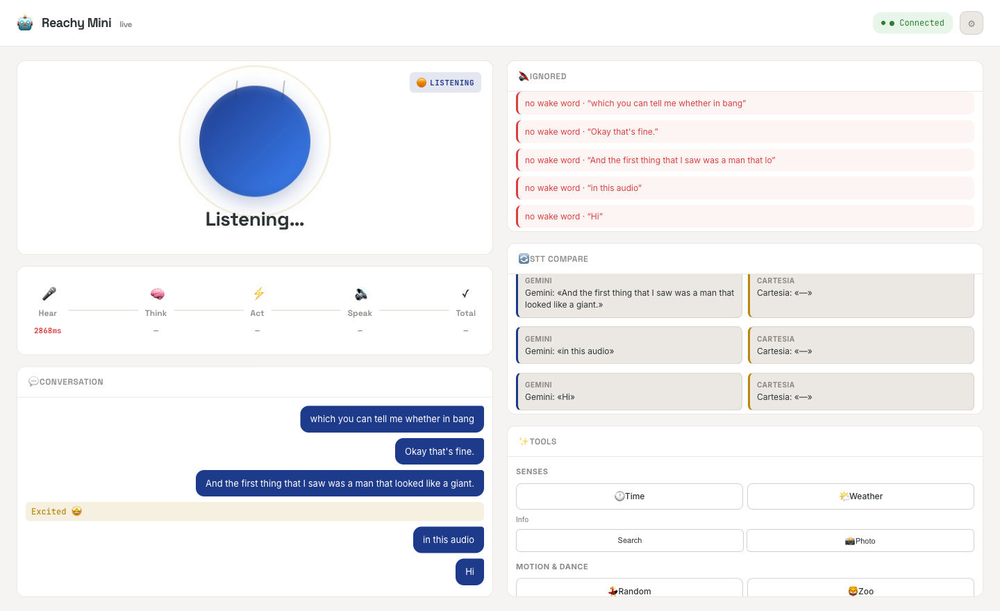

# Reachy Gemini

A small, always-on **voice agent for the [Reachy Mini](https://www.pollen-robotics.com/reachy-mini/) robot**. You talk, it listens, thinks, and talks back — and it can *do* things: check the weather, search the web, dance, react with full-body emotions, look around, take a photo, set reminders, and remember you across conversations.

It runs entirely as a turn-based pipeline with a **live latency dashboard** so you can see exactly where every millisecond goes.

```
  you speak ─▶ VAD gate ─▶ STT (Gemini) ─▶ Gemini Flash (text + tools) ─▶ TTS (Cartesia) ─▶ robot speaks
              └────────────── every stage timed & streamed to the dashboard ──────────────┘
```

> Works on the robot **and** on a laptop (no hardware needed for development).



---

## Highlights

- **Natural wake word** — only responds when addressed by name ("Reachy"), matched *fuzzily* because speech-to-text mangles the name ("richie", "reaching", "riddhi"…). Stays awake for a short follow-up window so you don't repeat the name every sentence.
- **Sleep mode** — tell it to sleep and it goes dormant until you call it again.
- **13 tools** the model calls on its own: time, weather, web search, volume, reminders, photo, expressions, look-around, dance, stop, vision, remember/recall.
- **Inbuilt emotions** — plays 80+ professionally-recorded full-body emotion animations (curious, proud, laughing, amazed, …).
- **Memory** — remembers facts about you across sessions via [mem0](https://mem0.ai), and answers as someone who knows you.
- **Vision** — describes what it sees through the camera.
- **Dancing** — full-song routines that combine many moves, matched to the track's tempo.
- **Live dashboard** — a single-file web page that shows the pipeline in real time: per-stage latency heatmap, conversation transcript, a side-by-side STT model comparison, and one-click controls for every tool.

## The dashboard

Open `http://<robot-ip>:8080` on your network. It connects over Server-Sent Events and moves with whatever the robot actually hears and says — millisecond-stamped, so bottlenecks are obvious. It doubles as a control panel (fire any tool with a click) and a debug tool (see what each STT model transcribed for the same audio, and why any utterance was skipped).

A `⚙ Config` tab lets you set API keys (mem0, Gemini, Cartesia) without touching files.

## How it works

| Stage | What | Backend |
|------|------|---------|
| Listen | Local energy VAD gate buffers your whole utterance | — |
| STT | Transcribe the utterance | Gemini (accurate) or Cartesia Ink-Whisper (fast) |
| Brain | Short reply + function calls, thinking off for low latency | Gemini Flash-Lite |
| TTS | Speak the reply | Cartesia Sonic |

It's deliberately **turn-based**: it only listens between turns, so the robot never hears itself — no echo cancellation needed.

### Modules (`reachy_gemini/`)

| File | Role |
|------|------|
| `app.py` | The turn loop + per-stage timing + audio capture/STT comparison |
| `wake.py` | Fuzzy wake-word matcher + wake/sleep state machine |
| `brain.py` | Gemini text brain with function-calling tools + memory injection |
| `tools.py` | The 13 tools (time, weather, search, dance, emotions, memory, …) |
| `memory.py` | Long-term memory via mem0 |
| `stt.py` / `tts.py` | Cartesia / Gemini speech in and out |
| `expressions.py` | Plays the inbuilt recorded emotion library |
| `body.py` | Robot vs. laptop audio + motion |
| `events.py` / `webview.py` | Event bus + the live dashboard server |
| `config.py` | Layered config (tracked `config.yaml` + gitignored `config.local.yaml`) |

## Setup

```bash
git clone https://github.com/ankitaggarwal/everything-agent.git
cd everything-agent
pip install -e .            # or: pip install -r requirements.txt
```

### Keys

The tracked `config.yaml` never holds secrets. Put your keys in a gitignored **`config.local.yaml`** (or matching env vars, or the dashboard's ⚙ Config tab):

```yaml
gemini:
  api_key: "..."        # https://aistudio.google.com/apikey  (also $GEMINI_API_KEY)
cartesia:
  api_key: "..."        # https://cartesia.ai  (also $CARTESIA_API_KEY)
mem0:
  api_key: "m0-..."     # optional — enables long-term memory (https://mem0.ai)
```

Weather uses [Open-Meteo](https://open-meteo.com) (no key), and web search uses Gemini's Google Search grounding (no extra key).

## Run

```bash
# Laptop (mic + speakers, no robot motion) — for development
python -m reachy_gemini

# On the Reachy Mini, it's launched by the robot's app daemon as the `gemini` app.
```

Then open the dashboard at `http://localhost:8080` (laptop) or `http://<robot-ip>:8080` (robot).

## Configuration

Everything is in `config.yaml` — model choice, voice, the VAD thresholds, the wake-word follow-up window, the weather default city, and debug toggles (audio logging + STT comparison). Each knob is commented.

## Hardware

Built for the **Reachy Mini Wireless** (Raspberry Pi, on-board mic/speaker/camera, moving head + antennas). The `reachy_mini` SDK provides motion and media; this app supplies the brain and the voice.

## Tech

[Gemini](https://ai.google.dev/) (STT + text brain + vision) · [Cartesia](https://cartesia.ai) (Sonic TTS) · [mem0](https://mem0.ai) (memory) · [Open-Meteo](https://open-meteo.com) (weather) · the [Reachy Mini](https://github.com/pollen-robotics/reachy_mini) SDK + emotion/dance libraries.

## License

MIT — see [LICENSE](LICENSE).
